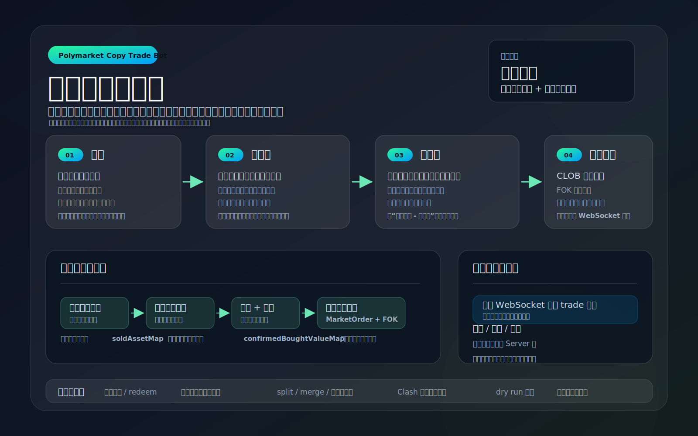

# Polymarket Copy Trade Bot

## TL;DR



Languages:

- [中文版](#中文版)
- [English Version](#english-version)

## 中文版

一个基于 Polymarket CLOB API 的跟单机器人。程序会定时读取目标地址的持仓，按策略过滤后，对自己的账户执行建仓或加仓，并在成功成交后通过 Server 酱推送通知。

### 主要功能

- 定时扫描目标钱包持仓，当前默认每 1 分钟执行一轮。
- 支持按持仓价值、均价、现价等条件过滤目标仓位。
- 支持固定额度或按目标仓位动态计算跟单额度。
- 每轮执行前查询自己的最新仓位，根据剩余额度决定是否建仓或加仓；成交会通过用户 WebSocket 实时确认并推送。
- 手动清仓或成交卖出的资产会短期记忆，避免刚卖出又被策略买回。
- 支持高价持仓自动挂单退出、已结算持仓 redeem、手动市价/限价卖出。
- 支持通过 relayer 执行 split / merge / redeem，并处理负风险市场。
- 支持 Clash 代理健康检查和自动切换节点。
- 支持 dry run 模拟交易，不真实下单。
- 支持提交前密钥扫描，降低误提交 `.env`、私钥、token 的风险。
- 支持 PM2 运行编译后的 `dist/index.js`。

### 技术栈

- Node.js + TypeScript + ESM
- Effect：组织异步流程、错误处理和重试
- `@polymarket/clob-client-v2`：Polymarket CLOB 下单与市场信息
- Axios：HTTP 请求
- Redis：项目内通用缓存/存储封装
- PM2：生产进程管理

### 目录结构

```text
src/
  copyTrade.ts              跟单策略与主循环
  cashout.ts                高价退出和已结算 redeem
  sell.ts                   手动卖出工具
  wsInstance.ts             Polymarket WebSocket 封装
  index.ts                  程序入口
  polymarket/api.ts         Polymarket API 与 CLOB Client
  polymarket/relayer.ts     Relayer split / merge / redeem
  middleware/
    axios.ts                Axios 实例
    clashManager.ts         Clash 代理健康检查
    logger.ts               日志模块
    notify.ts               Server 酱推送
    RedisService.ts         Redis 封装
  types.ts                  类型定义
scripts/
  activity.ts               Sports 周榜钱包活动分析脚本
out/                        分析脚本输出目录
ecosystem.config.cjs        PM2 配置
.env.exmple                 环境变量示例
```

### 使用步骤

1. 安装依赖

```bash
npm install
```

2. 准备第三方组件

项目运行依赖 Redis。请先按官方文档在本机或服务器准备可连接的 Redis 服务：

- Redis 安装与运行文档：https://redis.io/docs/latest/operate/oss_and_stack/install/install-redis/

3. 创建环境变量文件

```bash
cp .env.exmple .env
```

然后在 `.env` 中填入自己的私钥、funder 地址、CLOB API 凭证等配置。

4. 开发模式运行

```bash
npm run dev
```

5. 编译

```bash
npm run build
```

6. 运行编译后的文件

```bash
npm start
```

7. 使用 PM2 运行

```bash
npm run build
pm2 start ecosystem.config.cjs
```

常用 PM2 命令：

```bash
pm2 logs polymarket-copy-trade
pm2 restart polymarket-copy-trade
pm2 stop polymarket-copy-trade
```

### 常用脚本

| 命令 | 说明 |
| --- | --- |
| `npm run dev` | 开发模式启动跟单主循环 |
| `npm run build` | 编译 `src` 到 `dist` |
| `npm run start` | 运行编译后的主程序 |
| `npm run cashout` | 执行一次高价退出 / redeem 检查 |
| `npm run sell <asset-or-title> [-p price]` | 按 token 或标题匹配持仓并卖出；不传 `-p` 为市价卖出，传入则挂限价单 |
| `npm run split -- -s <slug> <amount>` | 按 market slug split outcome token |
| `npm run split -- -c <conditionId> <amount>` | 按 conditionId split outcome token |
| `npm run activity` | 分析 Sports 周榜钱包最近 7 天 BUY 表现，输出收益率靠前的钱包 |
| `npm run check:secrets` | 扫描 staged 文件中的疑似密钥 |
| `npm run install:hooks` | 安装 pre-commit 密钥扫描 hook |

### Sports 周榜活动分析

`npm run activity` 会读取 Sports 周榜钱包，统计最近 7 天符合条件的 BUY 交易，并按估算收益率输出前 50 个地址到 `out/sports-activity-week.csv`。脚本使用 Gamma `outcomePrices` 估算已结算/当前价格，控制台只保留合格用户的进度行和 HTTP 错误信息。

输出字段为 `address, marketCount, cost, pnl, pnlRate`。可选环境变量：

| 变量 | 默认值 | 说明 |
| --- | --- | --- |
| `ACTIVITY_LEADERBOARD_USERS` | `500` | 从 Sports 周榜读取的候选钱包数量 |
| `ACTIVITY_LEADERBOARD_PAGE_SIZE` | `50` | 排行榜分页大小 |
| `ACTIVITY_PAGE_SIZE` | `1000` | Activity 分页大小 |
| `ACTIVITY_MAX_ACTIVITY_OFFSET` | `3000` | Activity 最大 offset，超过 `3000` 会自动限制为 `3000` |
| `ACTIVITY_MARKET_BATCH_SIZE` | `40` | 每批通过 Gamma 查询价格的 token 数 |
| `ACTIVITY_OUTPUT_LIMIT` | `50` | CSV 输出地址数量 |

### 配置文件说明

`.env` 不会被 Git 跟踪，请只在本地或服务器上保存真实值。

| 变量 | 说明 |
| --- | --- |
| `PRIVATE_KEY` | 下单钱包私钥 |
| `FUNDER` | Polymarket funder/proxy wallet 地址 |
| `CLOB_HOST` | Polymarket CLOB API 地址，默认可使用 `https://clob-v2.polymarket.com` |
| `GAMMA_HOST` | Gamma API 地址 |
| `CHAIN_ID` | 链 ID，Polygon 为 `137` |
| `CLOB_API_KEY` | CLOB API key |
| `CLOB_SECRET` | CLOB API secret |
| `CLOB_PASS_PHRASE` | CLOB API passphrase |
| `POLY_BUILDER_CODE` | 可选，builder code |
| `BUILD_API_KEY` | Relayer builder API key |
| `BUILD_SECRET` | Relayer builder secret |
| `BUILD_PASS_PHRASE` | Relayer builder passphrase |
| `RELAYER_API_KEY` | Relayer API key，保留配置 |
| `RELAYER_ADDRESS` | Relayer 地址，保留配置 |
| `ENABLE_AGENT` | 是否启用代理配置 |
| `AGENT_PROTOCOL` | 代理协议，例如 `http` |
| `AGENT_HOST` | 代理地址 |
| `AGENT_PORT` | 代理端口 |
| `POLYMARKET_WS_URL` | 可选，自定义 Polymarket WebSocket 地址 |
| `ENABLE_CLASH_MANAGER` | 是否启用 Clash 代理健康检查 |
| `CLASH_API_URL` | Clash 控制 API 地址 |
| `CLASH_SECRET` | Clash 控制 API secret |
| `CLASH_GROUP` | Clash 代理组名称 |
| `CLASH_NODE_KEYWORD` | 自动选择节点时的名称关键词 |
| `CLASH_CHECK_INTERVAL_MS` | Clash 检查间隔 |
| `CLASH_HEALTHY_DELAY_MS` | 当前节点健康延迟阈值 |
| `CLASH_TARGET_DELAY_MS` | 自动选择节点的目标延迟 |
| `CLASH_DELAY_TEST_URL` | Clash 延迟测试 URL |
| `CLASH_DELAY_TIMEOUT_MS` | Clash 延迟测试超时时间 |
| `SERVER_CHAN_KEYS` | Server 酱 SendKey，多个 key 用英文逗号分隔 |
| `DRY_RUN` | 设置为 `1`、`true`、`yes` 或 `on` 时只模拟交易，不真实下单 |

`.env.exmple` 中还保留了一些备用配置项，例如 RPC、Influx、Relayer 等，目前主流程不一定都会使用。

### 策略配置

跟单策略位于 `src/copyTrade.ts` 的 `STRATEGY` 数组中。每个策略包含：

- `enable`：是否启用策略。
- `address`：目标跟单钱包地址。
- `nickname`：策略名称，用于日志和通知。
- `filter`：目标持仓过滤函数。
- `amount`：跟单额度，可以是固定数字，也可以是根据目标仓位动态计算的函数。
- `dryRun`：策略级模拟交易开关。

下单逻辑会用 `amount - 自己当前该资产 initialValue` 计算剩余额度。若剩余额度在 `0.6` 到 `1` 之间，会按 `1 USDC` 下单；若小于等于 `0.6`，则跳过。

### 风控与错误处理

- 每轮策略执行前会先查询自己的仓位；如果查询失败，本轮策略会跳过，不会继续下单。
- 数据 API 的 502 错误会自动重试，重试后仍失败会记录日志并等待下一轮。
- 手动清仓的资产会进入内存黑名单，默认保留 2 天，避免清仓后又被策略买回。
- 用户 WebSocket 会自动重连；长时间重连失败后进入冷却再继续尝试。
- Cashout redeem 失败会短期记忆，避免反复请求同一个失败的 redeem。
- 真实成交确认后才会发送推送；推送失败只记录日志，不影响主流程。
- 可安装 pre-commit hook，在提交前阻止 `.env`、私钥、API key 等敏感信息进入仓库。

### 日志

日志默认写入 `logs/` 目录，同时输出到控制台。`logs/` 已在 `.gitignore` 中忽略。

### 隐私与安全

- 不要提交 `.env`、私钥、API key、真实 RPC token 或 Server 酱 key。
- `.gitignore` 已忽略 `.env`、`.env.*`、`node_modules/`、`dist/`、`logs/`、`.vscode/` 等本地文件。
- 建议先用 `DRY_RUN=true` 观察日志，确认策略符合预期后再开启真实交易。

### 免责声明

本项目仅用于自动化交易研究和个人工具使用。预测市场交易存在风险，任何策略都可能亏损。请确认你理解相关风险，并自行承担交易结果。

## English Version

A copy-trading bot built on top of the Polymarket CLOB API. It periodically reads positions from target wallets, filters them with configurable strategies, opens or scales into matching positions for your own account, and sends a ServerChan notification after a successful fill.

### Features

- Periodically scans target wallet positions. The default cycle interval is 1 minute.
- Filters target positions by position value, average price, current price, and custom rules.
- Supports fixed copy amount or dynamic amount calculation based on each target position.
- Fetches your latest positions before every cycle, calculates remaining allocation, and confirms fills through the user WebSocket channel.
- Remembers manually closed or sold assets for a short period to avoid buying them back immediately.
- Supports high-price cashout orders, resolved-position redeem, and manual market/limit selling.
- Supports relayer-based split / merge / redeem flows, including negative-risk markets.
- Supports Clash proxy health checks and automatic node switching.
- Supports dry run mode for simulation without placing real orders.
- Blocks likely secrets from commits through an optional pre-commit scan.
- Supports running compiled `dist/index.js` with PM2.

### Tech Stack

- Node.js + TypeScript + ESM
- Effect for async workflows, typed errors, and retries
- `@polymarket/clob-client-v2` for Polymarket CLOB market data and orders
- Axios for HTTP requests
- Redis wrapper for project-level cache/storage utilities
- PM2 for production process management

### Project Structure

```text
src/
  copyTrade.ts              Copy-trading strategy and main loop
  cashout.ts                High-price cashout and resolved-position redeem
  sell.ts                   Manual sell helper
  wsInstance.ts             Polymarket WebSocket wrapper
  index.ts                  Application entry point
  polymarket/api.ts         Polymarket API and CLOB Client
  polymarket/relayer.ts     Relayer split / merge / redeem helpers
  middleware/
    axios.ts                Axios instance
    clashManager.ts         Clash proxy health checker
    logger.ts               Logger
    notify.ts               ServerChan notification
    RedisService.ts         Redis wrapper
  types.ts                  Type definitions
scripts/
  activity.ts               Sports leaderboard wallet activity analyzer
out/                        Analyzer output directory
ecosystem.config.cjs        PM2 configuration
.env.exmple                 Environment variable example
```

### Getting Started

1. Install dependencies

```bash
npm install
```

2. Prepare third-party services

This project depends on Redis. Prepare a reachable Redis service locally or on your server by following the official documentation:

- Redis installation and runtime docs: https://redis.io/docs/latest/operate/oss_and_stack/install/install-redis/

3. Create your local environment file

```bash
cp .env.exmple .env
```

Then fill `.env` with your private key, funder address, CLOB API credentials, and other required values.

4. Run in development mode

```bash
npm run dev
```

5. Build

```bash
npm run build
```

6. Run the compiled output

```bash
npm start
```

7. Run with PM2

```bash
npm run build
pm2 start ecosystem.config.cjs
```

Common PM2 commands:

```bash
pm2 logs polymarket-copy-trade
pm2 restart polymarket-copy-trade
pm2 stop polymarket-copy-trade
```

### Common Scripts

| Command | Description |
| --- | --- |
| `npm run dev` | Start the copy-trading loop in development mode |
| `npm run build` | Compile `src` to `dist` |
| `npm run start` | Run the compiled main program |
| `npm run cashout` | Run one high-price cashout / redeem check |
| `npm run sell <asset-or-title> [-p price]` | Match a position by token or title and sell it; omit `-p` for market sell, pass it for limit sell |
| `npm run split -- -s <slug> <amount>` | Split outcome tokens by market slug |
| `npm run split -- -c <conditionId> <amount>` | Split outcome tokens by conditionId |
| `npm run activity` | Analyze recent Sports leaderboard BUY performance and export top wallets |
| `npm run check:secrets` | Scan staged files for likely secrets |
| `npm run install:hooks` | Install the pre-commit secret scan hook |

### Sports Activity Analyzer

`npm run activity` reads Sports leaderboard wallets, evaluates qualifying BUY activity from the last 7 days, and writes the top 50 wallets by estimated ROI to `out/sports-activity-week.csv`. It uses Gamma `outcomePrices` instead of CLOB `/price`, so it works better for historical Sports markets that may already be resolved.

The CSV fields are `address, marketCount, cost, pnl, pnlRate`. Optional environment variables:

| Variable | Default | Description |
| --- | --- | --- |
| `ACTIVITY_LEADERBOARD_USERS` | `500` | Candidate wallet count from the Sports weekly leaderboard |
| `ACTIVITY_LEADERBOARD_PAGE_SIZE` | `50` | Leaderboard page size |
| `ACTIVITY_PAGE_SIZE` | `1000` | Activity page size |
| `ACTIVITY_MAX_ACTIVITY_OFFSET` | `3000` | Maximum activity offset; values above `3000` are capped to `3000` |
| `ACTIVITY_MARKET_BATCH_SIZE` | `40` | Token batch size for Gamma price lookups |
| `ACTIVITY_OUTPUT_LIMIT` | `50` | Number of wallets written to the CSV |

### Environment Variables

`.env` is ignored by Git. Keep real secrets only on your local machine or server.

| Variable | Description |
| --- | --- |
| `PRIVATE_KEY` | Private key of the wallet used for signing orders |
| `FUNDER` | Polymarket funder/proxy wallet address |
| `CLOB_HOST` | Polymarket CLOB API host, usually `https://clob-v2.polymarket.com` |
| `GAMMA_HOST` | Gamma API host |
| `CHAIN_ID` | Chain ID. Polygon is `137` |
| `CLOB_API_KEY` | CLOB API key |
| `CLOB_SECRET` | CLOB API secret |
| `CLOB_PASS_PHRASE` | CLOB API passphrase |
| `POLY_BUILDER_CODE` | Optional builder code |
| `BUILD_API_KEY` | Relayer builder API key |
| `BUILD_SECRET` | Relayer builder secret |
| `BUILD_PASS_PHRASE` | Relayer builder passphrase |
| `RELAYER_API_KEY` | Reserved relayer API key |
| `RELAYER_ADDRESS` | Reserved relayer address |
| `ENABLE_AGENT` | Whether to enable proxy settings |
| `AGENT_PROTOCOL` | Proxy protocol, for example `http` |
| `AGENT_HOST` | Proxy host |
| `AGENT_PORT` | Proxy port |
| `POLYMARKET_WS_URL` | Optional custom Polymarket WebSocket URL |
| `ENABLE_CLASH_MANAGER` | Whether to enable Clash proxy health checks |
| `CLASH_API_URL` | Clash control API URL |
| `CLASH_SECRET` | Clash control API secret |
| `CLASH_GROUP` | Clash proxy group name |
| `CLASH_NODE_KEYWORD` | Node-name keyword used for automatic selection |
| `CLASH_CHECK_INTERVAL_MS` | Clash health check interval |
| `CLASH_HEALTHY_DELAY_MS` | Current-node healthy latency threshold |
| `CLASH_TARGET_DELAY_MS` | Target latency for selected nodes |
| `CLASH_DELAY_TEST_URL` | Clash latency test URL |
| `CLASH_DELAY_TIMEOUT_MS` | Clash latency test timeout |
| `SERVER_CHAN_KEYS` | ServerChan SendKeys, separated by commas |
| `DRY_RUN` | Set to `1`, `true`, `yes`, or `on` to simulate without placing real orders |

`.env.exmple` also contains several optional or reserved values such as RPC, Influx, and Relayer settings. Not all of them are used by the current main flow.

### Strategy Configuration

Strategies are defined in the `STRATEGY` array in `src/copyTrade.ts`. Each strategy contains:

- `enable`: whether the strategy is active.
- `address`: target wallet address to follow.
- `nickname`: strategy display name used in logs and notifications.
- `filter`: function used to filter target positions.
- `amount`: copy amount, either a fixed number or a dynamic function based on the target position.
- `dryRun`: strategy-level simulation switch.

The order amount is calculated as `amount - current initialValue of your own position`. If the remaining amount is between `0.6` and `1`, the bot rounds it up to `1 USDC`; if it is `0.6` or lower, the bot skips the order.

### Risk Control and Error Handling

- The bot fetches your own positions before every strategy cycle. If that request fails, the whole cycle is skipped and no orders are placed.
- Data API 502 errors are retried automatically. If retries still fail, the error is logged and the bot waits for the next cycle.
- Manually closed assets are kept in an in-memory blocklist for 2 days by default, preventing the bot from buying them back too soon.
- The user WebSocket automatically reconnects; after prolonged failures it enters a cooldown and then keeps trying.
- Cashout redeem failures are remembered temporarily to avoid repeatedly submitting the same failing redeem.
- Notifications are sent only after real confirmed fills. Notification failures are logged and do not stop the trading loop.
- The optional pre-commit hook blocks `.env`, private keys, API keys, and other likely secrets before they enter the repository.

### Logs

Logs are written to the `logs/` directory and also printed to the console. `logs/` is ignored by Git.

### Privacy and Security

- Never commit `.env`, private keys, API keys, real RPC tokens, or ServerChan keys.
- `.gitignore` excludes `.env`, `.env.*`, `node_modules/`, `dist/`, `logs/`, `.vscode/`, and other local files.
- It is strongly recommended to start with `DRY_RUN=true` and inspect logs before enabling real trading.

### Disclaimer

This project is intended for automated trading research and personal tooling. Prediction market trading involves risk, and any strategy may lose money. Make sure you understand the risks and take full responsibility for your own trading results.
